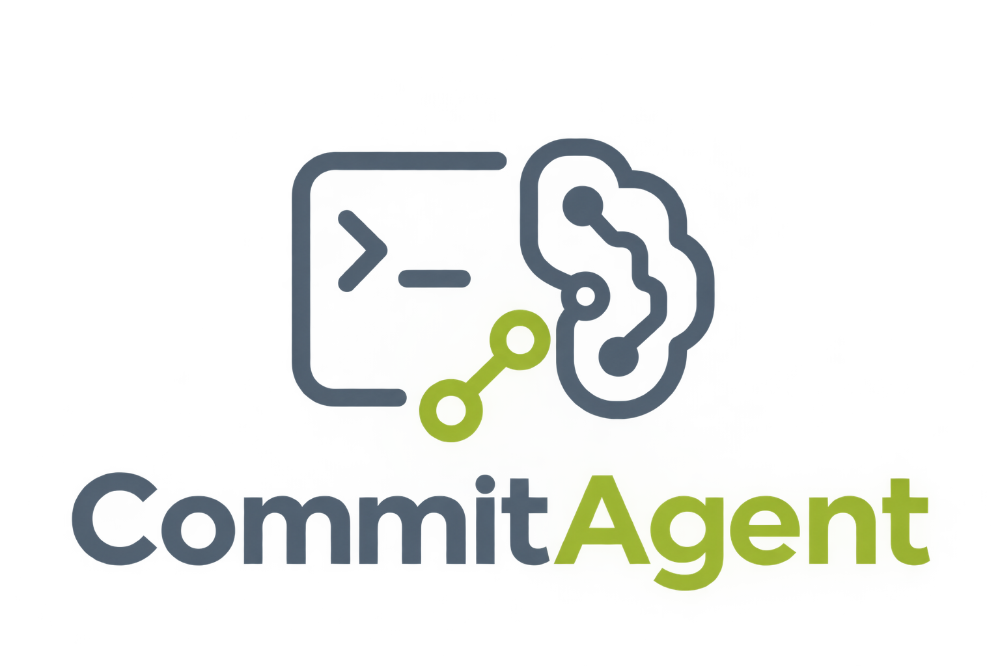

<div align="center">



</div>

<hr>

<div align="center">

<p>A simple CLI tool that analyzes Git changes using a local LLM and generates Conventional Commit messages.</p>

</div>

## How it works

```text
Git changes
     ↓
  Git diff
     ↓
Commit Agent
     ↓
  Local LLM
     ↓
Commit message
```

## Features

* Analyze Git changes
* Generate Conventional Commit messages
* Run entirely with a local LLM
* Ollama integration
* CLI-based
* AI provider abstraction

## Requirements

* [.NET 10](https://dotnet.microsoft.com/)
* [Git](https://git-scm.com/)
* [Ollama](https://ollama.com/)

## Getting started

Clone the repository and navigate to the project:

```bash
git clone git@github.com:saviotomazb/commit_agent.git
cd commit_agent
```

Run the application:

```bash
dotnet run --project src/commit_agent -- analyze
```

The application analyzes the current Git diff and asks the local LLM to generate a Conventional Commit message.

Example:

```text
refactor: update model name in OllamaProvider
```

## Roadmap

### Completed

* [x] Create CLI application
* [x] Integrate Git
* [x] Read Git diff
* [x] Create LLM provider abstraction
* [x] Integrate Ollama
* [x] Generate Conventional Commit suggestions
* [x] Create first testable release (`v0.1.0`)

### Next steps

* [ ] Create `CommitSuggestion` model
* [ ] Implement structured LLM output
* [ ] Validate generated Conventional Commit messages
* [ ] Improve prompt design
* [ ] Add configurable LLM model
* [ ] Move configuration outside the source code
* [ ] Improve CLI commands and output
* [ ] Add error handling for unavailable Ollama instances
* [ ] Add unit tests
* [ ] Evaluate additional LLM providers
* [ ] Introduce Dependency Injection
* [ ] Improve provider extensibility
* [ ] Explore agent capabilities and tool usage

## Learning Goals

Commit Agent is also a practical study project focused on:

* C# fundamentals
* Object-oriented programming
* SOLID principles
* Single Responsibility Principle
* Interfaces and abstractions
* Dependency Injection
* HTTP communication
* JSON serialization
* LLM integration
* AI provider abstraction
* CLI application design
* Agent architecture

The project intentionally avoids unnecessary architectural complexity. New abstractions and patterns will be introduced when they solve an actual problem in the application.